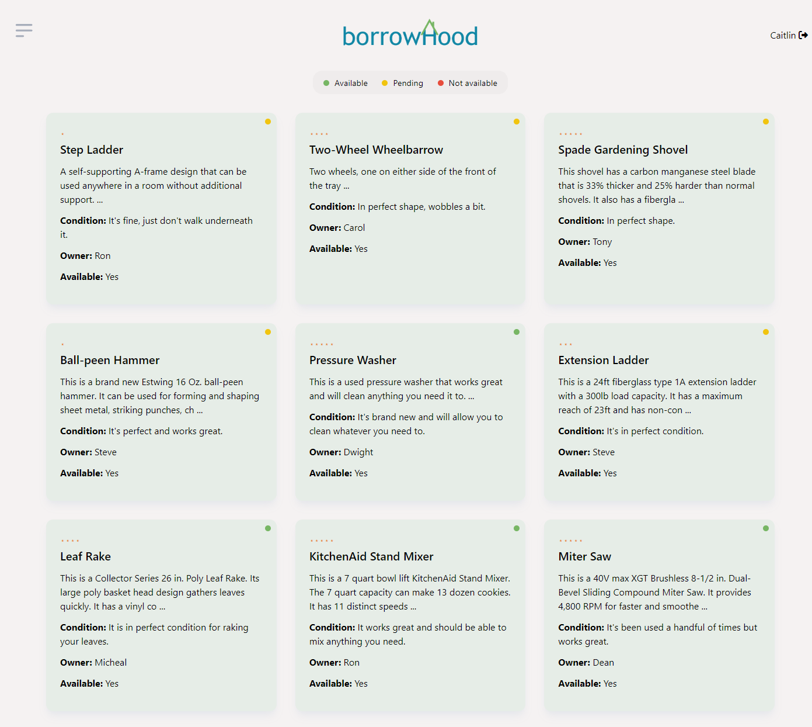

# Borrowhood

## Description
Borrowhood is an application which allows people to borrow needed items from their neighbors. It also allows neighbors to lend and borrow tools, equipment, and household items with or from one another. It encourages community interaction and sharing of resources which, in turn, minimizes individual purchases and decreases landfill waste. It's easy and fast to sign up and start listing items available for lending or searching for what you need!

## Table of Contents
- [Mockup](#mockup)
- [Installation](#installation)
- [Usage](#usage)
- [License](#license)
- [GitHub](#github)
- [Deployed Application](#deployed)

## Mockup

## Installation
N/A

## Usage
Borrowhood makes it easy to find tools and equipment that you need to borrow in your own neighborhood. Look up specific tools, check out ratings, see buyer profiles and more.

## License
MIT

## GitHub
GitHub Repository: https://github.com/skywalkah/borrowhood/tree/develop

## Credits
Developers: [Arianne Pandini](https://github.com/aripandini), [Caitlin Ramsey](https://github.com/caitlinramsey), [Joshua Wongg](https://github.com/joshuawongg), and [Lucas Schvindt](https://github.com/skywalkah)

Framework: [Tailwind CSS - Daisy UI](https://daisyui.com/docs/install/)

## Deployed Application
Application: https://polar-beach-65067-18b2f94f915d.herokuapp.com/